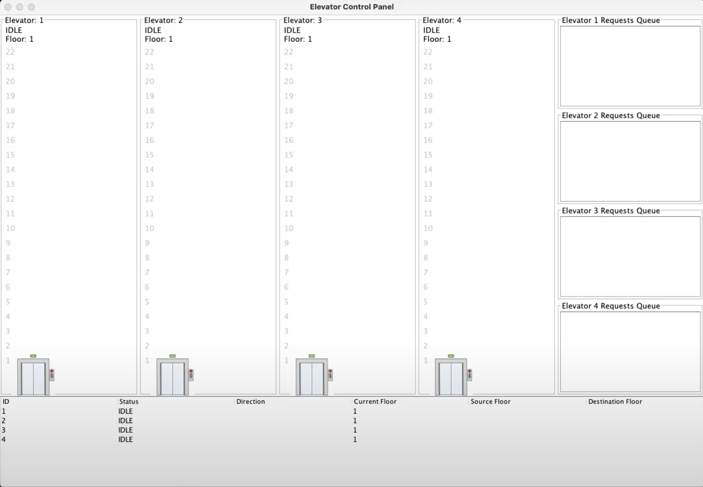
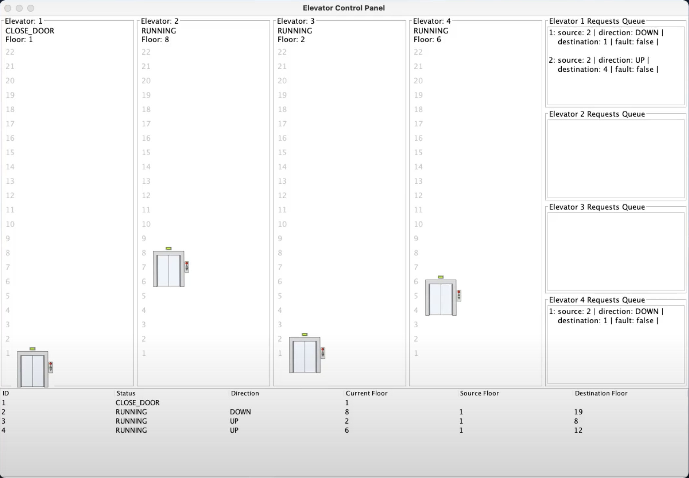
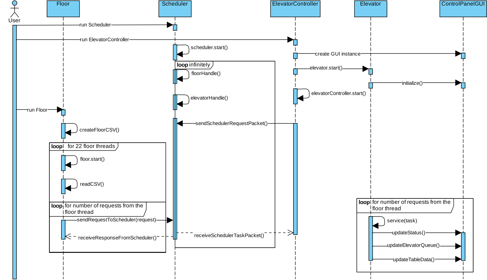
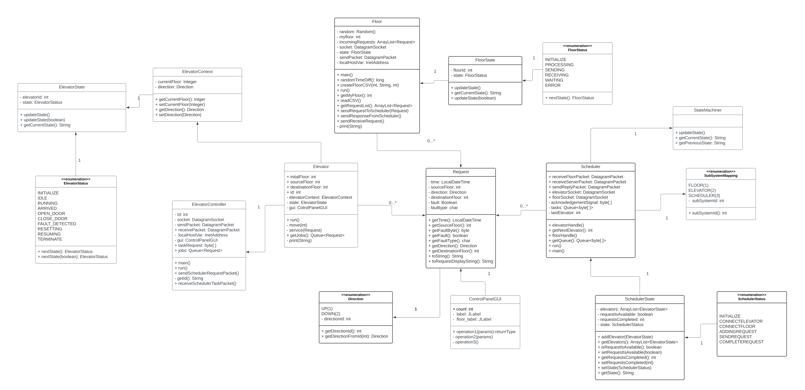

<h1>SYSC3303A Real-Time Concurrent Systems Project</h1>
<h2>Lab 2: Group #6</h2>
<b>Iterative Development Approach. Each iteration/increment in separate branch.</b>
  
<b>Team Members:</b>
 
  Amuwala Meesthrige, Lasitha  
  Hout, Bonita   
  Khara, Navaty  
  Mak, Tyler     
  Ojha, Anant    
  
   
Demo Link:	   https://youtu.be/w3qq8DSZHgA 
 
Github Link:	 https://github.com/anantojha/Multithreaded-Elevator-System 

### Screenshots

 
 

 
Run Instructions:
 
1. Run Scheduler.java
 
2. Run ElevatorController.java (GUI window will open, always set to full screen)
 
3. Run Floor.java 
